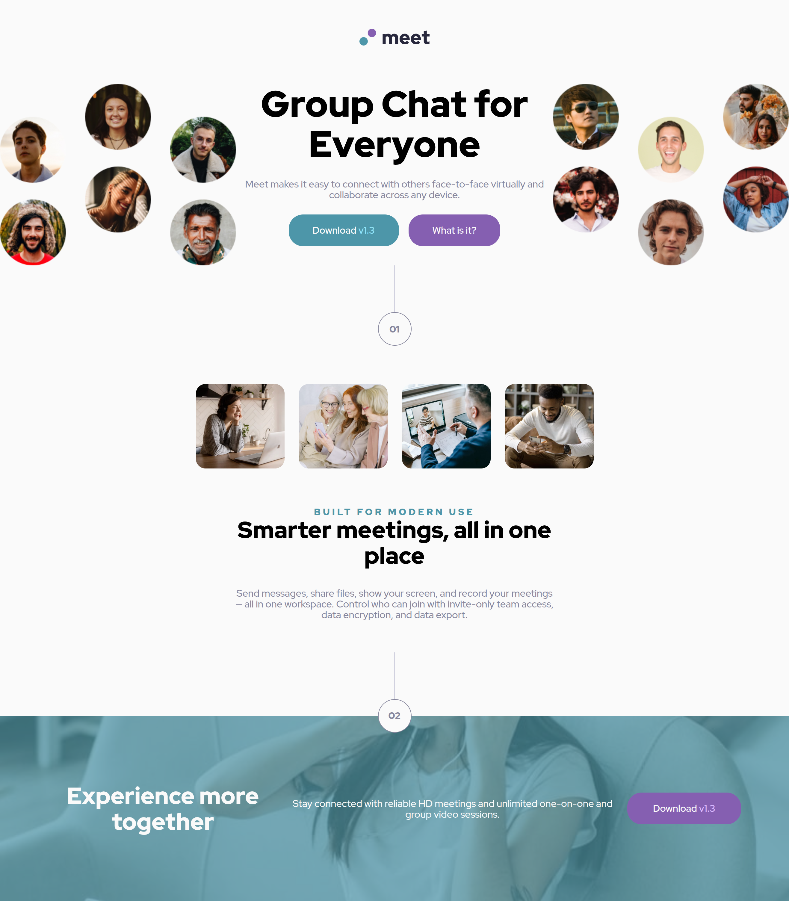

# Frontend Mentor - Meet landing page solution

This is a solution to the [Meet landing page challenge on Frontend Mentor](https://www.frontendmentor.io/challenges/meet-landing-page-rbTDS6OUR). Frontend Mentor challenges help you improve your coding skills by building realistic projects.

## Table of contents

- [Overview](#overview)
  - [The challenge](#the-challenge)
  - [Screenshot](#screenshot)
  - [Links](#links)
- [My process](#my-process)
  - [Built with](#built-with)
  - [What I learned](#what-i-learned)
  - [Continued development](#continued-development)
  - [Useful resources](#useful-resources)
  - [AI Collaboration](#ai-collaboration)
- [Author](#author)
- [Acknowledgments](#acknowledgments)

## Overview

### The challenge

Users should be able to:

- View the optimal layout depending on their device's screen size
- See hover states for interactive elements

### Screenshot



### Links

- Solution URL: [Add solution URL here](https://your-solution-url.com)
- Live Site URL: [Add live site URL here](https://your-live-site-url.com)

## My process

### Built with

- Semantic HTML5 markup
- CSS custom properties
- Flexbox
- CSS Grid
- Mobile-first workflow

### What I learned

I learned how yo position the number list over the section and use of pseudo classes. Also aligned content vertically with layout utility classes wrapper & inner-align.

```css
/* bullet list number style */
.number {
  color: var(--color-slate-600);
  display: flex;
  flex-direction: column;
  align-items: center;
}
/* line */
.number::before {
  content: "";
  width: 1px;
  height: 78px;
  background-color: var(--color-slate-300);
}
/* circle. set w & h to center text */
.number p {
  border: 1px solid var(--color-slate-600);
  border-radius: 50%;
  width: 56px;
  height: 56px;
  font-weight: 900;
  justify-content: center;
}
```

```css
.footer-content {
  position: relative;
  background: url("../assets/mobile/image-footer.jpg") center / cover;
}
/* overlay color */
.footer-content::before {
  content: "";
  position: absolute;
  inset: 0;
  background-color: var(--color-cyan-600);
  opacity: 0.7;
}
.footer-content .number {
  position: absolute;
  top: calc(-78px - 28px);
  left: 50%;
  transform: translateX(-50%);
  z-index: 10;
}
```

```css
/* container to align content vertically by setting same responsive width in all sections */
.wrapper {
  width: min(100% - 3rem, 1120px);
  margin-inline: auto;
}

/* container to align inner content vertically  */
.inner-align {
  width: min(calc(100% - 3rem), 540px);
  margin-inline: auto;
}
```

## Author

- Website - [Moises Navas](https://mnav08.github.io/portfolio-website/)
- Frontend Mentor - [@moinav08](https://www.frontendmentor.io/profile/mnav08)
